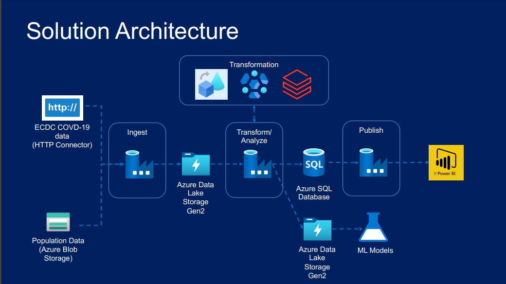

# Covid19 Reporting

## Objective

* Orchestrated pipelines to ingest raw covid data, transform it and store it in SQL.

## Tools Used
* Storage: Adls Gen 2, Azure blob
* Server: SQL Server
* Warehouse: Azure Data Factory, Azure Databricks
* Credentials: Azure Key Vault

Solution Architecture

